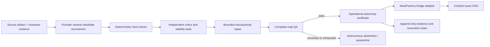

# ULTIMATE MASKING SYSTEM — AUTONOMOUS CORE COMPLETION AND COMFYUI BRIDGE
## Document 24: Claim-Scoped Completion, Operational Autonomy, and Cross-Project Integration

**Status:** governing amendment
**Applies to:** MaskFactory, its ComfyUI node pack and service, and the consuming `C:\Comfy_UI_Main` control plane
**Tracker implementation:** `Plan\Items\21_ITEMS_P6_AUTONOMOUS_CORE_AND_CROSS_PROJECT_BRIDGE.md`
**Completion registry:** `Plan\Tracker\completion_track_registry.json`

---

## 1. Decision and supersession

MaskFactory has three independent completion profiles. Only
`core_autonomous_runtime` defines whether the requested autonomous masking product and its ComfyUI
integration are complete. The other profiles measure additional claims and maturity; they never delay,
reduce, or revoke a valid core-runtime completion unless a defect also invalidates a core gate.

This document supersedes every older sentence that treats any of the following as a global prerequisite
for the autonomous runtime:

- human-anchor masks, manual CVAT correction, or a blinded human review;
- a minimum corpus of 200, 300, or 500 packages;
- qualification or download of every model in a proposed library;
- DAZ acquisition, asset qualification, rendering, or synthetic-data training;
- a seven-day DAZ soak; or
- an independent real-image mIoU, boundary-F, or false-accept-rate claim.

Those activities remain useful and tracked in their proper optional profile. They cannot be silently
reintroduced into `core_autonomous_runtime` through a phase exit, Definition-of-Done rollup, goal,
dashboard percentage, legacy headline test, or downstream consumer requirement.

The correction is a separation of claims, not a relaxation of the autonomous system. Core completion
still requires deterministic hard checks, instance ownership, independent critics, bounded repair,
abstention, immutable evidence, exact-output certificates, revocation, recovery, and a demonstrated
MaskFactory-to-ComfyUI vertical slice.

The completion registry binds the exact bytes of this governing document and its own canonical JSON
hash. Tracker validation fails if either changes without an explicit reseal, preventing a prose edit or
registry substitution from silently changing the product finish line.

Hash-sealed historical evidence surfaces, including documents 18 and 21 and their live-verification
records, remain byte-immutable rather than being rewritten to manufacture new historical evidence.
Their human/training-gold language is interpreted only inside the explicitly named optional profile.
For the core route, the controller must satisfy the exact operational certificate policy or return
typed abstention; a historical human-review route cannot become a hidden core dependency.

---

## 2. Frozen completion profiles

### 2.1 `core_autonomous_runtime` — required

This profile answers one question: **Can MaskFactory autonomously produce, verify, serve, revoke, and
recover exact mask artifacts that ComfyUI can safely consume?**

It permits the claim `operational autonomous runtime complete` only when all of its tracker gates pass.
It does not claim independently measured real-world accuracy. Required evidence is generated without
manual mask drawing or a human approval decision and includes:

1. contract/schema negative fixtures and deterministic replay;
2. exact synthetic truth, seeded-defect, metamorphic, perturbation, and cross-provider disagreement tests;
3. real or generated governed images processed without manual mask correction;
4. deterministic hard-veto and complete-map checks;
5. independent critic evidence with correlated-family accounting;
6. bounded repair, no-progress termination, abstention, and quarantine;
7. exact-output operational certificates bound to source, masks, ontology, pipeline, QA, and revocation;
8. single-person and multi-person ownership/transform demonstrations;
9. Mode A package reads and Mode B draft prediction/refinement demonstrations;
10. crash/restart, stale-cache, service-outage, idempotency, and rollback demonstrations; and
11. a pinned release/adoption handshake with the main ComfyUI controller.

An abstained or quarantined input is a correct autonomous result when the system cannot prove the
requested scope. Core completion measures safe autonomous operation and selective coverage, not a rule
that every possible input must be accepted.

### 2.2 `independent_real_accuracy` — optional and non-blocking

This profile authorizes claims such as real-image mIoU, boundary-F, calibrated false-accept bounds, or
comparative model superiority. It may use frozen human-anchor masks, CVAT corrections, blinded audits,
and image-disjoint real holdouts. Failure, absence, or incompleteness affects only those claims. It does
not change core runtime authority for exact artifacts already accepted under the operational policy.

### 2.3 `scale_daz_maturity` — post-core and non-blocking

This profile covers large-corpus scale, full model-library challenges, custom training, 300/500-package
targets, DAZ asset qualification, synthetic-data benefit, and long-duration DAZ reliability. It begins
after core completion when resources and assets are available. It may improve coverage or performance,
but is not part of the autonomous product's initial finish line.

### 2.4 Claim firewall

Every report, dashboard, certificate, release note, and App surface must name its profile. A green core
profile must not be displayed as independent accuracy or DAZ maturity. Conversely, an incomplete
optional profile must not make the core profile red. The tracker computes each profile from a distinct
set of item IDs and shows all three simultaneously.

The pre-existing `qa/governance/completion/modernization_completion_v1.json` all-domain bundle is a
legacy portfolio/research evidence index only. It is explicitly non-blocking for core, carries no core
completion authority, and may not override the tracker-computed `core_autonomous_runtime` status even
when its D1–D11, G1–G9, human, scale, or DAZ evidence is incomplete.

Operational certification and training truth are also separate namespaces. An exact artifact may earn
`operationally_certified_artifact` for a named use without becoming `human_approved_gold`,
`autonomous_certified_gold`, an independent-accuracy anchor, or training data. Promotion into a
training-truth tier is a distinct governed transaction with its own policy, evidence, signer, and
revocation scope. No bridge receipt, LLM decision, or downstream acceptance can perform that promotion.

---

## 3. Core autonomous Definition of Done

`core_autonomous_runtime` is complete only when all of the following hold:

| Gate | Required outcome |
|---|---|
| Contract authority | Closed schemas reject unknown fields, incompatible versions, hash drift, path escape, invalid truth escalation, ambiguous instance ownership, untrusted/revoked signers, noncanonical signatures, and lifecycle contradictions. |
| Autonomous generation | Every promoted person receives explicit instance-owned candidates and complete-map artifacts through the provider-neutral pipeline. |
| Hard QA | Format, ontology, dimensions, exclusivity, protected regions, left/right, identity, cross-instance bleed, and transform round-trip failures veto acceptance. |
| Critic diversity | Votes preserve model-family provenance; correlated variants cannot satisfy an independent-source quorum. |
| Repair | Repairs are ROI-bounded, protected-mask aware, reversible, hypothesis-distinct, and capped by attempts, time, and no-progress rules. |
| Abstention | Uncertainty, OOD, disagreement, sparse evidence, service unavailability, or exhausted repair produces a typed autonomous abstention/quarantine—not a fabricated pass and not a mandatory human task. |
| Certification | Accepted exact outputs receive an active operational autonomy certificate. No draft, stale, revoked, or mismatched output receives production authority. |
| Revocation | Material drift, policy/fingerprint changes, hash mismatch, or a serious discovered defect revokes affected scope and invalidates downstream cache/routes. |
| Reproducibility | The same pinned input, policy, models, and seed reproduce the same decision and artifact hashes, or the run records an explicit nondeterministic provider boundary. |
| Serving | Mode A and Mode B honor their separate authority rules and never write MaskFactory gold from ComfyUI. |
| Integration | The main controller consumes a pinned MaskFactory release through a typed adapter and proves single-/multi-person vertical slices plus failure recovery. |

Core completion does **not** require that every provider or model be installed. A capability snapshot
declares the exact installed, qualified execution stacks. The router filters to that snapshot and
abstains when no eligible stack exists. Later model downloads create a new capability/release snapshot,
not a retroactive blocker on the prior valid release.

---

## 4. Autonomous decision architecture

MaskFactory remains the authority for masks, mask QA, mask certificates, and mask revocation. The main
ComfyUI controller remains the authority for scene/pass planning and downstream media promotion. The
LLM/VLM may propose diagnoses, candidate families, prompts, and repair hypotheses, but cannot directly
write authoritative masks, waive hard checks, issue certificates, or promote downstream media.

The controller executes a diagnosis/hypothesis loop:

1. Identify the exact defect class, label, instance, target mask, protected masks, and coordinate space.
2. Retrieve only compatible and currently qualified providers/workflows.
3. Rank candidates from task-specific evidence while recording uncertainty and alternative routes.
4. Execute a bounded candidate or repair branch without changing the accepted parent.
5. Run hard vetoes, critics, perturbation/stability checks, and complete-map QA.
6. Accept only an evidence-improving result; otherwise form a materially different hypothesis.
7. Stop at acceptance, explicit abstention, no progress, attempt/time/resource cap, or typed outage.

Seed changes without a changed hypothesis are not an autonomous repair strategy.

### 4.1 Autonomous provider/model routing and evidence memory

The LLM does not select a masking model by name or preference. It produces a structured pass intent;
the deterministic router owns final selection. Every route key includes ontology, label/mask intent,
artifact kind, anatomy/context bucket, person count and occlusion/contact state, source dimensions,
operation (`predict`, `refine`, `repair`, or `critic`), authority floor, latency/resource envelope, and
active policy hash.

Selection has two stages:

1. **Hard compatibility filter:** remove stacks that are not installed, adopted, lifecycle-active,
   qualified for the exact route key, compatible with ontology/label/mode/dimensions/person count,
   within VRAM/deadline limits, or current under their benchmark/certificate/revocation scope.
2. **Contextual evidence rank:** rank the survivors using exact-route hard-veto rate, boundary and
   topology stability, ownership/left-right performance, independent-critic support, repair success
   and regression rate, protected-region preservation, latency/VRAM, evidence freshness, drift, and
   uncertainty. Quality and authority constraints are lexicographic; cost cannot buy a waiver.

The evidence store is append-only and separates observation from promotion. Each attempt records the
selected and alternate stacks, route key, source/output hashes, hypothesis, QA vector, critic-family
provenance, resource use, outcome, and failure taxonomy. Only governed benchmark or exact-output
evidence may update a route performance profile. One successful output, an LLM opinion, or a provider's
self-reported confidence cannot promote a stack. Champion/challenger state is per route key, supports
shadow comparison when evidence is close, and keeps the previous champion for immediate rollback.

If two qualified stacks are close within the frozen uncertainty margin, the controller may execute a
bounded branch tournament and let hard QA plus the independent critic policy choose. If evidence is
insufficient, all routes fail, or model-family correlation defeats the quorum, it abstains. A partial
model installation therefore remains honest and usable through the capability snapshot; newly
downloaded models enter as unqualified challengers and cannot affect production routing until their
own route-scoped evidence is accepted.

### 4.2 LLM/VLM roles, retrieval, memory, and tool authority

The autonomous intelligence layer is a set of separately qualified roles, not one unrestricted agent:

| Role | May produce | May not do |
|---|---|---|
| Request normalizer | Schema-bound intent, owner/label/space questions, ambiguity record | Invent missing identity, pixels, authority, or consent/evidence. |
| Planner/diagnostician | Pass intent, defect hypothesis, evidence-query plan, bounded alternatives | Select an incompatible stack or waive a deterministic requirement. |
| Router adviser | Ranked eligible route recommendations with uncertainty and cited evidence | Add a stack that failed the deterministic compatibility filter or promote a challenger. |
| Repair proposer | Hypothesis-distinct ROI/operation/parameter proposal within frozen budgets | Mutate an accepted parent, protected scope, retry cap, or authority. |
| Visual critics | Structured observations for assigned labels/context with family provenance | Issue certificates, clear hard vetoes, count correlated variants as independent, or self-score. |
| Evidence summarizer | Lossless, hash-cited summaries and route-performance observations | Rewrite raw events, omit failures, or turn an observation into promotion evidence. |

Every role is an exact execution stack: model/revision, runtime, quantization, prompt template, output
schema/parser, context limit, hardware envelope, benchmark certificate, lifecycle state, and hashes.
Self-hosted models enter through the same champion/challenger qualification as masking providers.
A cloud reviewer is never intrinsically required; a qualified, independently accounted self-hosted
critic set can satisfy the core critic policy.
Changing a model, quantization, system prompt, parser, sampling setting, or tool set creates a new stack
identity and invalidates evidence outside the declared compatibility policy.

Retrieval is registry-grounded and task-scoped. The controller builds a signed/hash-bound evidence
bundle containing only the adopted release/capability, exact request, current lifecycle state, relevant
ontology/policy, route cards, recent exact-context performance, failures, and immutable artifact
references. Every consequential proposal cites the record IDs and hashes it used. Model cards, filenames,
image metadata, provider text, and prior free-form notes are untrusted data; they cannot inject tools,
change instructions, or create authority.

Role outputs must validate against closed schemas before any action. The tool gateway maps a validated
proposal to an allowlisted capability, checks role authorization, release/capability pins, budgets,
idempotency, and current state, then records the result. Free-form model text is never executed. Missing
fields, invalid citations, low confidence, critic disagreement, context truncation that drops required
evidence, or an unavailable qualified role produces rerouting or typed abstention.

Durable memory lives in the signed event/evidence store: raw attempts are immutable; derived route
profiles are reproducible views; promotion decisions are separate records. Conversation history and
LLM-generated summaries are caches only. Context compaction publishes a manifest of retained/dropped
records and cannot discard current authority, blockers, failed hypotheses, budgets, or revocation state.
Shadow comparisons, role disagreement, calibration drift, prompt drift, and tool-policy drift are
measured per exact stack and can quarantine or roll back that role without disabling unrelated routes.

---

## 5. Operational autonomy certificate

The operational certificate is exact-output authority, not a population-accuracy statement or a
training-truth promotion. Its authority tier is `operationally_certified_artifact`. It binds:

- certificate ID, canonical certificate hash, trusted signer key ID, issuer role, issue/not-before/
  expiry time, signature algorithm, and status;
- source encoded-byte hash, canonical decoded-pixel hash, decoder/version, orientation, dimensions,
  channels, alpha, bit depth, color/ICC identity, and—for video—source-video hash, frame index,
  presentation timestamp, timebase, extraction policy, and optional frame-span/neighborhood identity;
- every mask's encoded-byte and canonical decoded-pixel hashes, format, dimensions, channels, dtype,
  value semantics, label, artifact kind, visibility/area, coordinate space, and owner binding;
- ontology version/hash and character-perspective left/right convention;
- pipeline, policy, provider, model, workflow, prompt, and runtime fingerprints;
- a structured, closed gate vector covering deterministic checks, independent critics, ownership,
  protected-region preservation, transforms, stability, repair/abstention behavior, person/context/risk
  scope, and every final pass/veto outcome;
- target/protected masks and transform-chain round trip;
- permitted uses such as production conditioning, QA, or repair seed;
- trusted signed event-journal/checkpoint identity, revocation snapshot/head/range, last revocation
  check, and freshness bound; and
- explicit claim limits: no independent real-accuracy or holdout-truth claim.

Issuance is fail-closed. A certificate cannot be created when a blocking QA check fails, evidence is
missing, the pipeline fingerprint is unregistered, the source/mask hash drifts, instance ownership is
ambiguous, a protected input lacks sufficient authority, a signer is untrusted/revoked/out of role, the
certificate is not valid at the decision time, or the adopted revocation state rejects the scope.

The system may issue certificates per label/region/instance. One failed region does not invalidate an
unrelated accepted region, but the package must expose partial scope honestly. A full-map consumer must
require all needed scopes rather than assuming one label certificate covers the image.

---

## 6. The two bridges that connect the projects

### 6.1 Runtime/data bridge

The main controller owns a `MaskFactoryAdapter`. It does not read arbitrary MaskFactory internals or
call unversioned nodes. The adapter offers two explicit modes:

- **Mode A — immutable package read:** read a package from the pinned package format and validate its
  hashes, declared truth/authority, ontology, instance, coordinates, and revocation state. Mode A is an
  access path, not authority: a raw package manifest, review status, filename, or certificate reference
  is capped at noncertified evidence. Production use requires a separately validated exact operational
  wrapper certificate covering the original package artifacts and intended use. This remains the
  preferred production path when that wrapper is active.
- **Mode B — live predict/refine:** call the localhost API for prediction or refinement. Its outputs are
  drafts unless an independent MaskFactory certification transaction subsequently grants exact-output
  operational authority to the exact original prediction evaluated in that transaction. A raw Mode B
  response can never claim that authority by itself. A refinement, derived mask, pseudo label, inpaint
  mask, or other descendant cannot exceed its parent authority merely because it was produced from a
  certified or reviewed ancestor; it requires its own eligible exact-output certification transaction.

ComfyUI nodes are thin execution/UI helpers. Durable orchestration, retries, arbitration, lineage, and
promotion decisions remain outside the graph in the main controller.

### 6.2 Project/session coordination bridge

The authoritative active Codex tasks are pinned as producer
`019f4cfc-60c3-7500-8626-261dcf70db5d` and consumer
`019f422f-88b1-7382-872b-21de2089e983`. Their durable preservation,
release/adoption order, invalidation resumption, and worktree-retention rules
are frozen in
`Plan/Instructions/09_CROSS_PROJECT_BRIDGE_RELEASE_AND_SESSION_HANDOFF.md`.
The isolated pre-commit packet is enumerated and byte-hashed by
`Plan/Instructions/10_AUTONOMOUS_CORE_BRIDGE_PLANNING_PRESERVATION_MANIFEST.json`;
that manifest preserves planning work but grants no release or runtime authority.
Task messages are coordination signals only; they never replace signed,
hash-bound release, adoption, certificate, journal, or test evidence.

The two autonomous build sessions must not continuously modify one another's dirty worktrees. They
coordinate through immutable producer/consumer artifacts:

1. MaskFactory publishes a trusted-signer, canonical, signed/hash-bound release and capability snapshot.
2. The main project pins the exact release and publishes authenticated consumer requirements.
3. The main project records an adoption receipt: adopted, partially adopted, or rejected, with reasons.
4. Both projects execute compatibility fixtures against the pinned snapshots.
5. MaskFactory publishes change/revocation/invalidation events.
6. The main project invalidates affected routes/caches and revalidates before further use.
7. The main project returns authenticated, replay-protected, typed repair/quality feedback without
   mutating MaskFactory truth or operational authority.

For this local project, versioned JSON artifacts, RFC 8785 JCS-compatible canonical bytes, trusted
Ed25519 key registries, hashes, Git identities, and signed/checkpointed append-only JSONL event journals
are sufficient. An embedded public key plus its own signature is not a trust anchor. Producer and
consumer roles have separate keys with rotation and revocation. A distributed message broker is
unnecessary.

---

## 7. Bridge contract set

The minimum closed contracts are:

| Contract | Producer | Purpose |
|---|---|---|
| `maskfactory_release_snapshot` | MaskFactory | Immutable Git/build/node-pack/wheel/API/schema/ontology/package-format identity. |
| `maskfactory_capability_snapshot` | MaskFactory | Exact installed and qualified providers, labels, modes, limits, hardware/runtime envelopes, and certificate authority. |
| `maskfactory_consumer_requirements` | Main controller | Needed labels, modes, authority floors, person counts, transforms, latency, and supported versions. |
| `completion_profile` | MaskFactory governance | Hash-bound definition of the required core, optional independent-accuracy, and post-core scale/DAZ claims. This governs release/adoption decisions; it is not repeated as per-request wire data. |
| `mask_acquisition_request` | Main controller | Idempotent source/instance/label/target/protected/transform/authority request. |
| `mask_acquisition_receipt` | MaskFactory adapter | Exact artifacts, hashes, authority, provider bundle, QA, lineage, and a producer-side policy observation that Main must independently recompute. |
| `operational_autonomy_certificate` | MaskFactory | Exact-output, policy-bound certification transaction recording scope, evidence, vetoes, validity, and revocation identity. |
| `mask_bridge_error` | Either side | Typed retryability, scope, blocker, remediation, and no-fallback reason. |
| `maskfactory_adoption_receipt` | Main controller | Accepted release/capability hashes and compatibility result. |
| `mask_authority_invalidation_event` | MaskFactory | Revoked certificate, package, provider, ontology, policy, or release scope. |
| `mask_repair_feedback` | Main controller | Hash-bound downstream defect/repair observation; advisory until MaskFactory validates it. |
| `mask_bridge_event` | Either side | Append-only lifecycle and correlation journal. |

### 7.1 Acquisition request fields

Every request carries project/run/job/pass/attempt/hypothesis and correlation IDs; authenticated
consumer/signing identity; source encoded-byte and decoded-pixel identity; image or video/frame/span
identity; scene/shot/take; character package revision and canonical scene-instance ID; declared owner
roster; provider-local `person_index` plus assignment evidence; one unique requested intent ID per
label/mask/space/owner; target and protected inputs with their own artifact authority/certificate state;
executable crop/resize/pad/flip transform steps; ontology, package, API, and release compatibility floors;
minimum intended-use authority/certificate scope; deadline, resource envelope, idempotency/replay key,
request time, and canonical request hash.

Transforms are executable records, not prose or opaque parameter hashes. Each step names input/output
spaces and dimensions, typed parameters, interpolation, padding, rounding, orientation and left/right
side-swap policy, and invertibility. The ordered canonical transform chain and, where supported, inverse
chain are hash-bound. Bounds, geometry, time order, nested hashes, and access-mode-specific payloads are
validated before admission.

### 7.2 Acquisition receipt fields

Every receipt carries request hash and binding ID; exact project/run/job/pass/attempt/hypothesis IDs;
admission/lease/submit/result timing and worker/resource facts; package/revision/source pixel identity;
canonical scene instance and provider-local assignment; exactly one distinct output for every intent
and no undeclared output; output artifact byte/pixel identity, owner, type, coordinate space, and
visibility; exact ordered transform chain and round-trip result; exact selected and alternate
provider/model/workflow/runtime routes plus selection reason; authority tier and issuer; certificate
ID/scope/validity/revocation; structured QA gate vector, confidence/uncertainty; complete parent lineage;
cache key/freshness; deadline/resource enforcement; and a closed
`use_eligibility` decision containing `policy_id`, `policy_sha256`, `required_authority_state`, exact
`use_scope`, `eligible`, and reasons. Eligibility is evaluated against that named, hash-bound consumer
policy and exact requested scope; it is never a global certified/not-certified shortcut. On the producer
wire this is an auditable policy observation, not Main promotion authority. Main validates it, preserves
it as producer evidence, discards it as a decision input, and independently recomputes intended-use
eligibility from the normalized factual receipt and its own pinned policy. A disagreement fails closed
and is journaled. If an adapter exposes a compatibility alias such as `can_satisfy_promotion_gate`, that
value is derived only from Main's independently recomputed complete decision and cannot be supplied by
an LLM or provider.

### 7.3 Error taxonomy

At minimum: service unavailable, timeout, rate/resource limited, incompatible API/schema/package/
ontology, release not adopted, capability absent, label unsupported, instance ambiguous, image/hash
mismatch, transform mismatch, path escape, certificate missing/expired/revoked/out-of-scope, QA veto,
draft authority insufficient, idempotency conflict, stale cache, and internal invariant violation.

The taxonomy is a closed decision matrix: each error code deterministically constrains category,
retryability, affected scope, completion-profile impact, remediation class, and permitted state
transition. Errors state retryability and affected scope. The adapter blocks only the dependent DAG pass where safe;
unrelated work may continue. It never silently substitutes an empty mask, a different person, a weaker
authority tier, or an unqualified provider.

### 7.4 Record trust, canonicalization, and artifact safety

Every content-addressed bridge record is validated from its actual bytes, not merely from an asserted
hash in another manifest. Release publication verifies the complete contract catalog: schema `$id`,
name/version, relative source path, canonical SHA-256, semantic profile, capability/requirements,
OpenAPI and build artifacts, compatibility fixtures, Git tree/commit, and completion-profile hashes.
The catalog rejects missing, duplicate, extra, or substituted records.

Canonical signing uses one frozen JSON canonicalization algorithm with golden cross-language vectors,
raw-key fingerprints, UTC timestamps, signer roles, key validity intervals, rotation, and revocation.
Consumer-authored requirements, requests, adoption receipts, and repair feedback are authenticated just
as producer records are. Replay windows and monotonic journal positions prevent a valid old message from
being accepted as current.

Paths and artifacts are fail-closed against drive/UNC escapes, traversal, alternate separators,
case-collision aliases, symlink/hardlink/reparse indirection, special files, and archive expansion bombs.
Encoded files and canonical decoded pixels are both hashed so metadata, decoder, alpha, palette,
antialiasing, channel, dtype, orientation, or color-management ambiguity cannot change the meaning of a
supposedly identical image or mask.

---

## 8. Authority and arbitration rules

1. MaskFactory is the only issuer and revoker of mask authority.
2. The main controller may reject a mask but cannot upgrade it.
3. A wrapper-certified exact Mode A artifact outranks an uncertified Mode B draft for the same exact
   scope; Mode A access alone grants no rank or authority.
4. A newer artifact does not outrank an older one unless its release, certificate, and evidence qualify.
5. Exact source hash, person/instance binding, ontology, and coordinate transform must match before use.
6. Drafts may be used for preview, bounded repair, or candidate comparison; production-conditioned passes
   require the authority floor declared by the pass contract.
7. Arbitration compares eligible receipts by exact task scope, QA, preservation risk, evidence freshness,
   and operational cost. It never compares incompatible latent representations; cross-engine consumers
   exchange decoded artifacts and explicit masks.
8. Cache identity includes release, capability, source, request, ontology, policy, provider bundle,
   certificate, and revocation-index hashes.

---

## 9. Release and adoption lifecycle

### 9.1 MaskFactory release snapshot

A release snapshot is immutable and contains:

- MaskFactory Git commit/tag and dirty-worktree refusal;
- wheel/node-pack hashes and dependency lock identities;
- typed runtime provenance: `native_venv` binds interpreter/environment/lock/CUDA/driver identities,
  while `container` binds image/config/digest identities; fields are conditional and no fake container
  hash is invented for a native runtime;
- API/OpenAPI and contract-schema versions/hashes;
- package format and ontology versions/hashes;
- node inventory and workflow fixture hashes;
- capability snapshot hash;
- certificate/revocation registry identity;
- compatibility matrix and minimum consumer versions;
- evidence index, known limitations, and breaking changes; and
- deterministic install/rollback commands.

Production consumers must not use editable installs, unpinned source folders, or a dirty worktree as
release authority.

### 9.2 Consumer requirements and adoption

The main project publishes a requirements artifact before adoption. MaskFactory computes a compatibility
result against it. The main project then records an adoption receipt binding both artifacts and the
tests executed. Partial adoption enumerates unsupported labels/modes and prevents routing into them.

### 9.3 Revocation and invalidation

A certificate revocation, package withdrawal, ontology change, provider lifecycle change, policy change,
signer/key compromise, or incompatible release emits an invalidation event. Events identify exact
targets or a provably homogeneous scope, effective time, old/new authority state, one or more required
consumer actions, rollback/supersession relation, reason, and journal position. The consumer applies
them idempotently, invalidates affected cache/route entries, and records revalidation. Historical
artifacts remain immutable and readable for audit but lose future production authority where the event
says so.

The revocation view is reconstructible from a trusted signed journal or a strict signed snapshot plus
checkpoint/head and covered sequence range. A bare `revocation_index_sha256`, unsigned hash chain, or
freely resealable journal is not sufficient. Consumers pin an adopted head, enforce freshness at use
time, detect forks/deletion/reordering, and fail closed when they cannot establish current state.

---

## 10. Reliability, recovery, and resource behavior

- All requests and events are idempotent; the same key with different content is an error.
- Writes use staging, fsync where applicable, atomic rename, and receipt-last commit.
- Restart reconstructs state from receipts/events rather than guessing from output filenames.
- Retries are bounded and only for typed transient failures; semantic/authority failures are not retried.
- A circuit breaker prevents repeated calls to an unhealthy Mode B service.
- GPU lease and VRAM envelopes are declared; resource refusal is typed and recoverable.
- The adapter records health/capability snapshots at decision time so later debugging sees what was true.
- A stale installed node pack fails compatibility rather than loading with missing/changed nodes.
- Service downtime never causes automatic fallback to an unverified mask source.
- Repair feedback is append-only and cannot mutate frozen packages or certificates.
- Every attempt follows a closed lifecycle state machine: admitted → routed → leased → submitted
  (known or unknown) → reconciled → result received → validated → cached/decided, with typed retry,
  repair, invalidation, cancellation, and recovery transitions. Illegal transitions fail closed.
- A lease loss or crash after submission is an `outcome_unknown` reconciliation problem, not permission
  to submit a duplicate. Recovery queries provider/history identity before a bounded retry.
- Kill/restart qualification injects failure at every durable boundary and proves receipt-last atomicity,
  no duplicate authority, no orphan promotion, exact replay, and deterministic terminal state.

---

## 11. Qualification matrix

Core release evidence must cover:

| Dimension | Required cases |
|---|---|
| Authority | Mode A valid, draft-only Mode B, expired/revoked/out-of-scope certificate, partial-label scope. |
| Ownership | Single person; two people with overlap/contact; wrong person index; character-instance mismatch. |
| Geometry | Full frame; crop/pad/resize; flip with side swap; round-trip failure; protected-mask mismatch. |
| Failures | API down, timeout, malformed response, stale node pack, missing provider, OOM/resource refusal, restart mid-transaction. |
| Idempotency | replay success, duplicate event, same key/different body rejection, receipt recovery after interruption. |
| Security/integrity | path escape, hash drift, unknown schema field, incompatible major version, forged certificate/release. |
| Trust/canonicalization | substituted embedded key, wrong signer role, expired/revoked key, noncanonical JSON, signature replay, signed-journal fork/delete/reorder, stale revocation head. |
| Artifact identity | encoded-byte/pixel mismatch, decoder/orientation/color drift, malformed/ambiguous mask encoding, alpha/palette/dtype/value-semantics mismatch. |
| Video/time | governed single frame, frame span, neighboring-frame context, wrong PTS/timebase/frame extraction, temporal QA failure, and typed unsupported video route. |
| Autonomy | hard-veto override, critic disagreement, bounded distinct repairs, no-progress stop, abstention, revocation. |
| Integration | single-person Mode A; multi-person Mode A; Mode B draft; exact original Mode B prediction certified by a subsequent independent transaction; derived/refinement parent-authority-ceiling negative case; downstream inpaint pass. |

The final cross-project qualification bundle binds both Git commits, release/capability/requirements/
adoption hashes, test output, source/mask/result hashes, ComfyUI history, fault injection, restart/rollback,
and profile status. No completion is inferred from code existence alone.

---

## 12. Implementation order

1. Freeze completion registry and tracker profile computation.
2. Freeze canonicalization, trusted role-key registry, signed journal/checkpoint, and revocation bootstrap.
3. Implement the operational-certificate versus training-truth claim firewall.
4. Freeze common authority, encoded/pixel identity, owner, video-time, and executable-coordinate crosswalk.
5. Implement release, capability, requirements, adoption, and invalidation artifacts.
6. Implement the controller-side adapter with Mode A first.
7. Prove single-person and multi-person Mode A ownership/transform cases.
8. Add Mode B client, typed outage handling, and draft-only authority.
9. Add a subsequent independent certification transaction for an eligible exact original Mode B
   prediction, and prove that refinement/derived descendants cannot inflate their parent authority.
10. Add feedback, signed lifecycle event journal, cache invalidation, restart, and rollback.
11. Publish the pinned MaskFactory release and main-project adoption receipt.
12. Run the complete cross-project qualification bundle and close `core_autonomous_runtime`.
13. Continue the two optional profiles independently when their data/assets are available.

This order allows the main ComfyUI project to integrate a stable, useful MaskFactory release without
waiting for the full model library, manual annotation, large-corpus training, or DAZ expansion.
